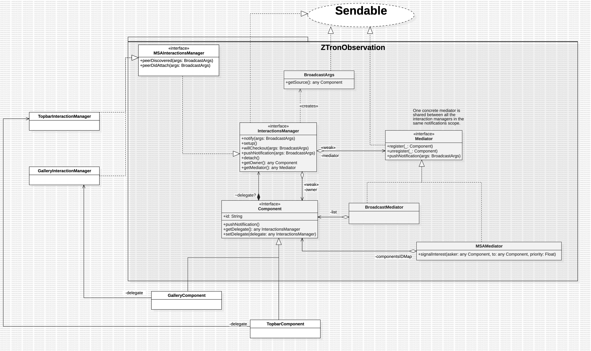

# ZTronObservation

## Core



A `Component` is an object in the notifications domain that can be updated when the state of other `Component`s change. 

Two or more `Component`s become part of the same notification subsystem when they `.register(_:)` on the same `Mediator` (that is, all the mediators of components in the same notifications subsystem store a reference to the same `Mediator` object).

A `Mediator` stores a reference to components in the shape of lists, graphs, or any other collection the client sees fit. It visits a subset of such collection to notify all the interested components about a state change, via `pushNotifications(_:)`, when one of the registered components invokes such a method through its delegate.

A component is unaware of what type of `Mediator` is being used, and all the coordination between states is moved in an object that implements `InteractionsManager` protocol. An interaction manager handles the registration, alignment of its `owner` with the up-to-date state of other components, update of `owner`'s state when other components detach, and eventually the un-registration of `owner`.

This way a Component can exist independently of whether or not it is inside a notification subsystem with minimal knowledge and overhead.


When a `Component` registers to a subsystem, it is advertised to all the other previously registered `Component`s and every other `Component` in the notification subsystem is announced to the new component. This is translated in the fact that the registering `Component`'s `InteractionManager`'s `.peerDiscovered(_:)` is invoked once for each previously existing component, and each previous existing component's `InteractionManager`'s `.peerDiscovered(_:)` is invoked with the new component as its argument. This way, every existing component discovers the new one and the new one becomes aware of all the other components in the environment. When the new `Component` configured itself and it's in a consistent state, it should invoke its `InteractionManager`'s `.peerDidAttach(_:)` to allow the interested `Component` to align themselves to the initial state of the new `Component`.

Usually `.peerDiscovered(_:)` is the mean through which a `Component` signals its interest (see `Mediator.signalInterest(_:,_:,_:)`) in the notifications from another `Component`.


A `Component` receives notifications about state changes via its `.notify(eventArgs:)` function, whose default implementation simply delegates the update to its `.delegate`. The delegate, that implements `.notify(eventArgs:)`, will typically query the type of the source of the update to perform the necessary operations on its `.owner`. For example

```
public class TopbarInteractionsManager: InteractionsManager {
  weak var owner: Topbar?

  // Something something

  public func notify(eventArgs: BroadcastArgs) {
    if let gallery = (eventArgs.getSource() as? GalleryComponent) {

      // What do I do if the source of the update was of type GalleryComponent?

    } else {
      if let toolBar = (eventArgs.getSource() as? ToolbarComponent) {

        // What do I do if the source of the update was of type ToolbarComponent?

      } else {
        // .... and so on
    }
  }
}
```

Before a `Component` leaves the notification subsystem, it invokes `willCheckout(_:)` to allow interested components to react to such event.

## Unfortunate side note

The default behavior should be that a Component stores a `delegate` property of type `any InteractionManager`, declared as follows:

```
var delegate: (any InteractionsManager)? {
        willSet {
            guard let delegate = self.delegate else { return }
            delegate.detach()
        }
    
        didSet {
            guard let delegate = self.delegate else { return }
            delegate.setup()
        }
    }
```

A new shortcut for this was later introduced, and now the same behavior can be achieved as follows:

```
@InteractionsManaging weak private var delegate: (any InteractionsManager)? = nil
```

Optionally, you can specify the conflict resolution strategy on setup and detach as follows: `@InteractionsManaging(setupOr: .ignore, detachOr: .fail) weak private var // and so on`

## Minimum Cost Spanning Arborescence 

This library uses GGST Fibonacci Heap-based Gabow's algorithm efficient implementation described in [this](https://mboether.com/assets/pdf/bother2023mst.pdf) paper to find the Minimum Cost Spanning Arborescence of a graph in `O(E+Vlog(V))` time, where `|E|` is the number of edges in the graph and `|V|` is the number of vertices. The code in this library is a Swift adaptation of [chistopher/arbok](https://github.com/chistopher/arbok/tree/5a38286e332552fe3c029afba57195e95182f90a)'s C++ version.

Performance was tested using a Macbook Air M1 2020 13", average runtime with 2k nodes was about 0.3s.

## Future directions

There are few things that deserve being discussed even shortly. 

#### No FIFO ordering
Currently it's not guaranteed that notifications are completed in the same order they are pushed into the notification subsystem. It's possible for example the following scenario:


- Component A pushes a notification.
- Currently, notifications are processed on the same thread that's used to call `pushNotification`. Assume for the sake of this example that components that are notified by Component A require heavy computation in their `.notify(args:)` block, and it takes long to complete.
- Component B pushes a notification on a different thread.
- Not many components depend on Component B's state, or their updates are lightweight.
- Component B's notification might end before Component A's.

This is not a great problem if components in your subsystem are idempotent, but if the component is stateful, the sequence of updates might be important to the correct functionality of your system. A way to mitigate the likely of this happening is to offload heavy computation bits of your `.notify` block to a different thread, but then you can't rely on `pushNotification`'s completion callback. The same scenario applies for other `InteractionManager`'s lifecycle hooks.


A seemingly reasonable proposal is to optionally allow registering a `Component` as a FIFO component, and keep in the state of `MSAMediator` a dictionary mapping `Component ID -> DispatchQueue`, with a shared lock protecting all the queues; then in `.pushNotification()`, wrap the notification processing in a `queueForThisComponent.async` block. 

An advantage of this approach is that one can have finer control on the `unregister()` process, for example one can drain the queue associated with the `Component` to unregister before processing the request. 

It's still to keep in mind that if `.notify(args:)` blocks offload some of the work to other threads, it's hard to provide guarantees on the sequence of completion of the requests. This suggests to move to another possible approach, that's based on `Actor`s. In this case lifecycle hooks are called in the actor's queue and executed sequentially as built-in guarantee. But this is not necessarily a good thing: if a `Component` fetches data from a database or network, subsequent lifecycle hooks of other components could be heavily delayed (eg 250ms), hurting the performance of the system as a whole. 

Maybe a good approach is to equip `MSAMediator` with multiple processing strategies, referred to as "dataflow tags"; for example one for `.concurrent` work, one for `.lastWins` works (a new work immediately cancels the previous before starting), `.serial` for FIFO work. I think it's reasonable that a `Component` doesn't mix this kind of behavior, so it can be a field on `Component` instead of a parameter to `.pushNotification()`. This also lets me extend this behavior to other hooks if it seems fit.


A consequence of what was discussed above is that with the current setting, a `.unregister()` call might complete before `.notify(args:)` blocks of `Component`s that depend on a source are all executed, therefore a `Component` trying to access the source of the notification to update their own state might result in a crash.


#### Another bug worth discussing:
Imagine that you're trying to use this notification subsystem within a `UIViewController` that's part of a `UICollectionView`. The latter try to recycle `UIViewControllers` in the process and for performance reasons, it's likely reasonable that you only want `Components` used from the currently visible `UIViewController` within the `UICollectionView` to be active in the notification subsystem. 

A way you could achieve this is to `.register()` to the `MSAMediator` on `viewDidAppear(animated:)`, and then unregister on `viewDidDisappear(animated:)`. Though, UIViewController lifecycle methods can be inconsistent when the user abandons a paging gesture. This is especially true if the next view controller and the next one are two clones, that is, different object identity but same state (at least the shard that's relevant to the notification subsystem).
