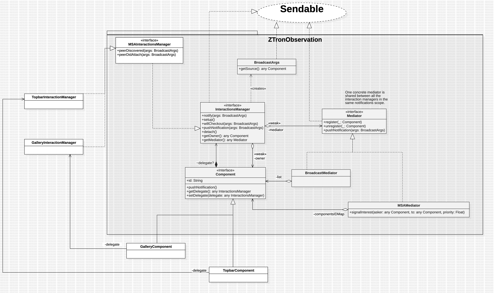

# ZTronObservation

## Core



A `Component` is an object in the notifications domain that can be updated when the state of other `Component`s change. 

Two or more `Component`s become part of the same notification subsystem when they `.register(_:)` on the same `Mediator` (that is, all the mediators of components in the same notifications subsystem store a reference to the same `Mediator` object).

A `Mediator` stores a reference to components in the shape of lists, graphs, or any other collection the client sees fit. It visits a subset of such collection to notify all the interested components about a state change, via `pushNotifications(_:)`, when one of the registered components invokes such a method through its delegate.

A component is unaware of what type of `Mediator` is being used, and all the coordination between states is moved in an object that implements `InteractionsManager` protocol. An interaction manager handles the registration, alignment of its `owner` with the up-to-date state of other components, update of `owner`'s state when other components detach, and eventually the un-registration of `owner`.

This way a Component can exist independently of whether or not it is inside a notification subsystem with minimal knowledge and overhead.

A `Component` receives notifications about state changes via its `.notify(eventArgs:)` function, whose default implementation simply delegates the update to its `.delegate`. The delegate, that implements `.notify(eventArgs:)`, will typically query the type of the source of the update to perform the necessary operations on its `.owner`. For example

```
public class TopbarInteractionsManager: InteractionsManager {
  weak var owner: Topbar?

  // Something something

  public func notify(eventArgs: BroadcastArgs) {
    if let gallery = (eventArgs.getSource() as? GalleryComponent) {

      // What do I do if the source of the update was of type GalleryComponent?

    } else {
      if let toolBar = (eventArgs.getSource() as? ToolbarComponent) {

        // What do I do if the source of the update was of type ToolbarComponent?

      } else {
        // .... and so on
    }
  }
}
```

## Minimum Cost Spanning Arborescence 

This library uses GGST Fibonacci Heap-based Gabow's algorithm efficient implementation described in [this](https://mboether.com/assets/pdf/bother2023mst.pdf) paper to find the Minimum Cost Spanning Arborescence of a graph in `O(E+Vlog(V))` time, where `|E|` is the number of edges in the graph and `|V|` is the number of vertices. The code in this library is a Swift adaptation of [chistopher/arbok](https://github.com/chistopher/arbok/tree/5a38286e332552fe3c029afba57195e95182f90a)'s C++ version.

Performance was tested using a Macbook Air M1 2020 13", average runtime with 2k nodes was about 0.3s.
